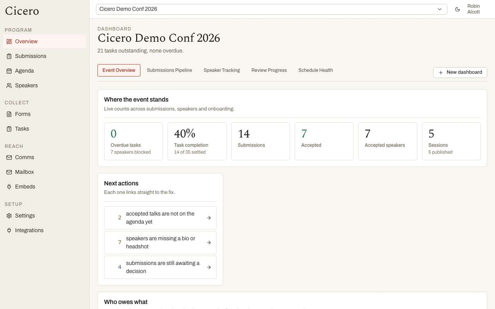
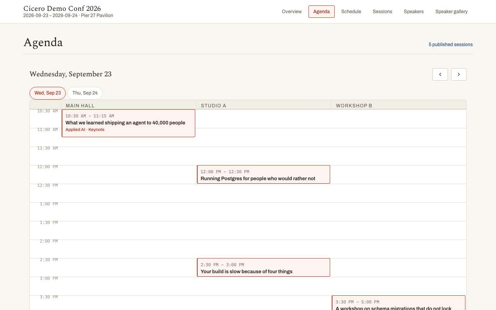
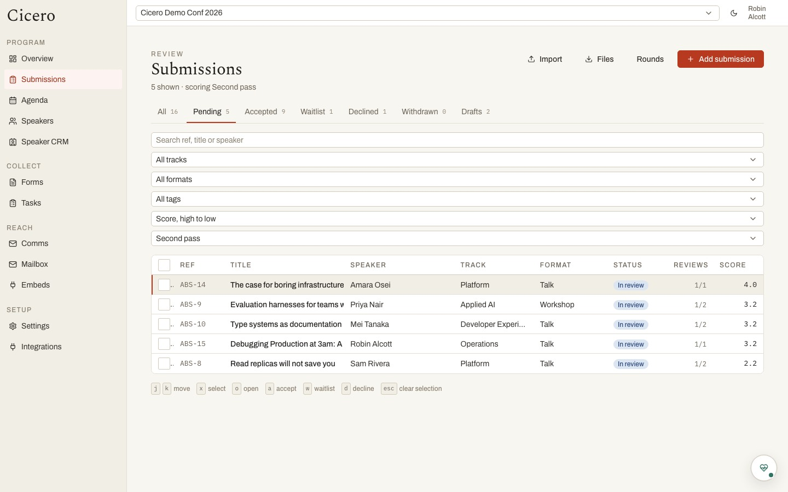
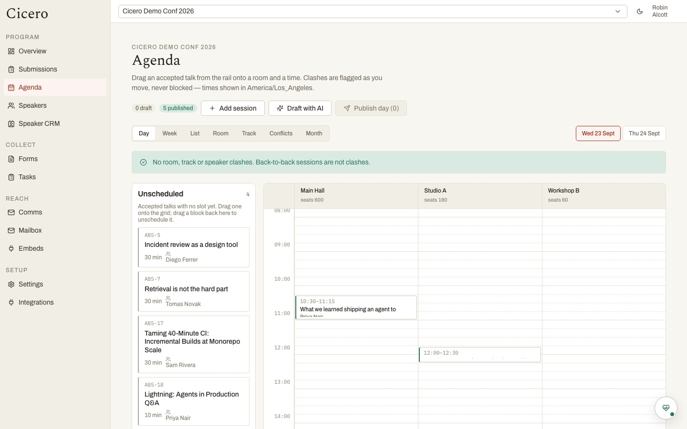
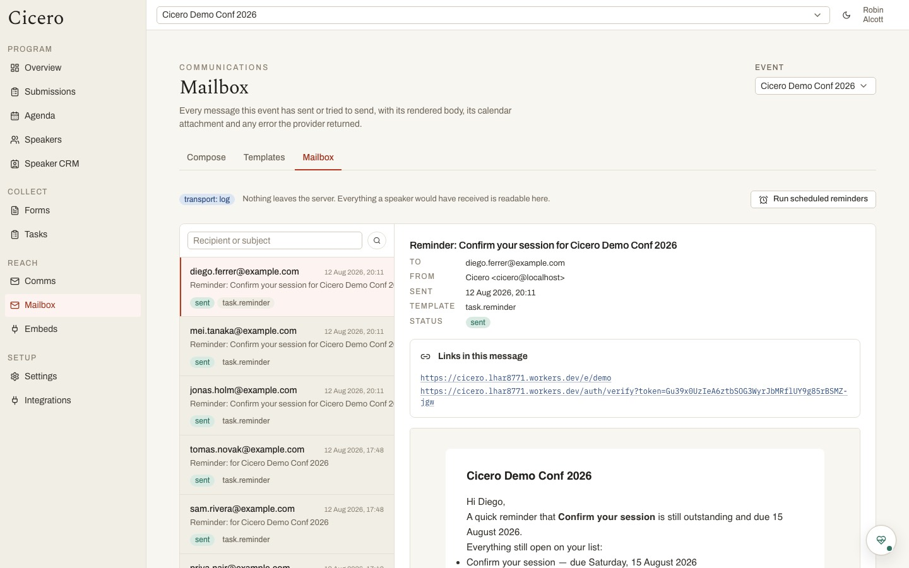

# Cicero

An open-source replacement for **Sessionboard** — the software a conference runs on between "we
should do a CFP" and "the agenda is on the website."

Built for the **"$10,000 Kill My SaaS"** competition run by the AI Engineer team.

Cicero covers the whole spine, not a slice of it:

> organizer configures an event → builds a call-for-speakers form → publishes it at a public URL →
> a speaker submits cold, account created in the flow → lands in a portal for bio, headshot and
> slides → organizer scores and accepts → the accepted talk is dragged onto the schedule → the
> speaker gets a templated email and a real calendar invite → the organizer watches who still owes
> a task → the agenda and speaker gallery embed back onto the event website.

MIT licensed. No account required to read a published agenda, no password anywhere, and a
one-command self-host that needs no API key from anyone.

## Look at the running one first

**<https://cicero.lhar8771.workers.dev>** is deployed and seeded.

Sign in as `organizer@example.com` and you land in the organizer dashboard. That deployment records
mail instead of sending it, so the sign-in link comes straight back on the page and you never need
an inbox; every message it would have sent is readable at
[`/admin/mail`](https://cicero.lhar8771.workers.dev/admin/mail).

Type your own address instead and it works the same way — an account is created on the spot and you
are dropped at "create an event," which is the cold path this was built to survive. Your event and
the seeded demo cannot see each other.

Without signing in at all: the [public event page](https://cicero.lhar8771.workers.dev/demo), the
[programme](https://cicero.lhar8771.workers.dev/demo/agenda), an
[open call for speakers](https://cicero.lhar8771.workers.dev/submit/demo/speak) you can submit to,
the [embeddable agenda](https://cicero.lhar8771.workers.dev/embed/demo/agenda) an event site would
iframe, and the [REST API](https://cicero.lhar8771.workers.dev/api/v1/events/demo/agenda).



The dashboard leads on who still owes you something, because that is the one report Sessionboard's
own FAQ says it does not have. Everything else on this page exists in the incumbent too.



## Try it in one command

```bash
docker compose up
```

Then open <http://localhost:3000>. That brings up the app, Postgres and MinIO, migrates the
database before serving, and creates the file bucket — there is no second command and nothing to
configure. Email has no API key in a fresh clone, so every message the app would send is recorded
and readable at **`/admin/mail`**; sign-in links included. Nothing about the walkthrough depends on
a real inbox.

To load the demo conferences:

```bash
docker compose exec app npm run db:seed
```

The seed creates two idempotent cases:

- **Cicero Demo Conf** — 14 submissions mid-review, 7 accepted speakers, 4 tracks, 3 rooms, and a
  two-day agenda with gaps still in it.
- **The First Settlement** — a Roman Senate-themed programme inspired by the sessions of
  13–16 January 27 BCE, with motions, consular review, a partly scheduled agenda, and outstanding
  speaker tasks.

Run it twice and you get the same two events, not four.

## Local development

```bash
cp .env.example .env       # defaults already point at the compose Postgres and MinIO
npm install
npm run db:migrate
npm run db:seed            # optional
npm run dev
```

Everything in `.env.example` is documented inline. The only variable that must be right in a real
deployment is `APP_URL`, because magic links, embed snippets and calendar invites are all built
from it.

| Script | |
|---|---|
| `npm run dev` | Next dev server |
| `npm run typecheck` | `tsc --noEmit` |
| `npm test` | `vitest run` |
| `npm run db:generate` | Generate a migration from `db/schema.ts` |
| `npm run db:migrate` | Apply migrations |
| `npm run db:seed` | Seed both demo conferences (idempotent) |
| `npm run cf:deploy` | Build and deploy to Cloudflare Workers |

## What's in it

**Call for speakers.** A drag-and-drop form builder over a hybrid schema: title, description,
format, track, level and tags are real Postgres columns — so the review queue sorts on them and the
agenda joins on them — while everything a form adds lands in JSONB. Conditional questions,
multi-step public runtime, per-submitter limits, drafts, character limits with a live counter, file
questions, CSV export.

**Review.** Rounds with assignments, weighted scorecard criteria, auto-distribution across
reviewers, blind-until-close and author-anonymized modes, recusal, reviewer workload reporting, and
a reviewer surface that shows a reviewer their assignments and nothing else — no accept/decline
controls, no event configuration.



**Speaker portal.** Magic-link sign-in, profile and headshot, deliverable uploads that version
rather than overwrite, review comments that reach the speaker, tasks with reminder cadences, custom
portal pages, group access.

**Agenda.** Drag sessions onto a day/room grid with conflict detection for room clashes, track
clashes and — the one the brief doesn't ask for — **speaker double-booking**, which is the clash
that fails publicly on the day.



**Comms.** Branded templates, a send log, and a real `.ics` `METHOD:REQUEST` that bumps `SEQUENCE`
so a reschedule *updates the existing calendar entry in place* rather than adding a second one.



**Public surfaces and embeds.** Sessions list, speakers directory, agenda grid, schedule itinerary
and speaker gallery — all server-rendered, all readable with no account, each with a copyable embed
snippet, per-embed filters and styling. The embed is an auto-resizing iframe over a live route, so
"updates without re-pasting the snippet" comes for free.

**Integrations.** A public REST API with a generated
[`docs/openapi.json`](docs/openapi.json) schema, an Accelevents speaker-push client, and a one-way
Airtable mirror.

### Bonus: operate an event with an agent

These three surfaces are extra value beyond the required replacement scope:

- **Public API bonus** — the generated OpenAPI contract exposes Cicero data to another site or
  tool without UI automation.
- **Inbound Accelevents bonus** — when the deployed OpenAPI advertises the program reconcile
  operation, an Accelevents-shaped collection can be previewed and atomically applied to Cicero.
  This is separate from the required outbound accepted-speaker push.
- **Agent operation bonus** — the repo-local `manage-cicero-event` skill turns either an event spec
  or Accelevents-shaped payload into a compare → preview → confirm → apply → verify workflow, with
  destructive confirmation and rollback guidance.

Codex loads repository skills from `.agents/skills` at the repository root. Invoke this one
explicitly with `$manage-cicero-event`, or ask Codex to manage a named Cicero event from a supplied
spec. The skill discovers the live OpenAPI before using a write route and stops cleanly when a
deployment is read-only. See the
[`First Settlement copy-ready prompt`](.agents/skills/manage-cicero-event/references/first-settlement-demo.md).
The discovery location and `$skill-name` invocation follow the
[official Codex skills documentation](https://developers.openai.com/codex/build-skills#where-codex-loads-local-skills).

## Deployment

**Cloudflare Workers** is the primary target, via `@opennextjs/cloudflare`:

```bash
wrangler hyperdrive create cicero --connection-string="<your-direct-postgres-url>"
# put the returned id in wrangler.jsonc
npm run cf:deploy
```

Any Postgres works — Neon, Supabase, RDS, your own box. Hyperdrive pools the connection at the
edge, which lets Workers use **the same `pg` driver and the same Drizzle schema** a self-hosted
container uses. That is deliberate: it is what keeps the hosting choice reversible. Postgres, an
S3-compatible bucket and HTTP email are all host-agnostic, so moving off Cloudflare costs a
redeploy and nothing else.

R2 is off by default, because enabling it requires a payment method on the Cloudflare account and
that is a bad thing to demand of someone cloning an open-source project. Uploads fall back to the
database until you turn it on; `wrangler.jsonc` says exactly how.

Two things to know before you deploy this yourself. The free plan's 10ms CPU limit is real and you
will notice it — see the last section. And **`next build` reads `.env` and inlines what it finds
into the bundle**, so a `.env` sitting in the working directory at build time ships to Cloudflare
baked into the worker. Keep secrets in `wrangler secret put`, and check that `.env` holds only
local development values before running `npm run cf:build`.

## Judgment calls worth arguing about

The competition's tiebreaker is "whoever made the subjective judgment calls for the product we would
actually use." These are ours, stated out loud rather than buried.

- **Magic links for every role. No passwords anywhere.** Sessionboard makes participants keep a
  password for a site they visit twice a year. They forget it, and the organizer becomes a help
  desk.
- **Impersonation, not preview.** The organizer's session carries `impersonated_by` and every write
  goes through *as the speaker* while staying attributable. A read-only "view as" is useless for
  support — the point is to finish the stuck speaker's task for them.
- **Speaker double-booking detection.** A room clash is a spreadsheet error someone catches. A
  speaker booked in two rooms at once is a failure the audience watches happen.
- **Calendar invites that update in place.** A real `METHOD:REQUEST` with a bumped `SEQUENCE`, so
  moving a talk to Thursday moves the entry already in the speaker's calendar. An add-to-calendar
  link, which is the usual reading of this requirement, ships as well, but it leaves the old slot
  sitting there after every reschedule.
- **The outstanding-task dashboard.** Sessionboard's own FAQ says it has no central
  task-completion report. This is the place we add something missing rather than clone something
  present.
- **Airtable as a one-way mirror, not the store.** Airtable carries a larger bonus than Cloudflare
  in the brief, and building on it as the primary database would have been the easy way to claim
  that. But with no transactions, no joins and a 5-request-per-second ceiling, agenda conflict
  detection stops being implementable. So submissions, speakers and the agenda *push* to a
  configurable base, their team gets Airtable views over live data, and the product stays correct.
- **A form engine we wrote.** Every off-the-shelf builder assumes it owns the entire schema and
  emits one blob; ours needs six fields to be real columns. Between that and the licensing (SurveyJS's
  builder is per-developer commercial, HeyForm/OpnForm/Formbricks are AGPL, form.io hard-depends on
  Bootstrap), renting the schema-walking loop would have cost 300KB–1MB to save about eighty lines.
  `docs/02-architecture.md` shows the full survey.
- **`showIf` may reference only an earlier field, one hop, no chaining**, and hidden fields clear at
  submit. A documented limit that deletes the cyclic- and cascading-condition bug class by
  construction, rather than a gap.

## How it is built

Next.js 15 App Router, React 19, TypeScript, Drizzle over Postgres, Zod as the API contract, plain
CSS Modules over a hand-built design system. No Tailwind, no component library, no rich-text editor
— Markdown with a live preview instead, which is what power users want and has no XSS surface.

Three layers, strictly:

```
app/api/v1/**      REST handlers — thin, Zod-validated, API-key auth
app/**             Server Components read; Server Actions write — thin
lib/services/**    all domain logic. Pure TS. No HTTP, no React, no Next imports
db/**              Drizzle schema, migrations, seed
```

The UI never calls its own HTTP API; both entry points call the same service function. Every table
is event-scoped from the first migration, so a judge's cold-created event and the seeded demo
coexist without either seeing the other.

## Documentation

1. **[`docs/00-goals.md`](docs/00-goals.md)** — what we are building and why, in prose
2. **[`docs/01-requirements.md`](docs/01-requirements.md)** — every requirement and deliverable,
   tagged `[REQUIRED]` / `[IMPORTANT]` / `[OPTIONAL]` / `[EXCLUDED]` / `[BONUS]`
3. **[`docs/02-architecture.md`](docs/02-architecture.md)** — hosting, the stack, the database and
   API layers, and the form-engine and integration decisions
4. **[`docs/03-plan.md`](docs/03-plan.md)** — the spine, the tiered scope, and the verification plan
5. **[`docs/04-adversarial-test-plan.md`](docs/04-adversarial-test-plan.md)** — the hostile-input
   matrix, current implementation audit, and safe execution gate for adversarial testing
6. **[`docs/openapi.json`](docs/openapi.json)** — the generated OpenAPI 3.1 schema for the public API

### Reference material

- [`docs/reference/source-brief.txt`](docs/reference/source-brief.txt) — the competition brief,
  extracted verbatim, with screenshot positions marked inline
- [`docs/reference/screenshots/`](docs/reference/screenshots/README.md) — all 42 screenshots from
  the brief, filed by section, with the author's hand-drawn priority annotations catalogued
- [`docs/reference/sessionboard-survey.md`](docs/reference/sessionboard-survey.md) — an independent
  inventory of the real Sessionboard product. **Not a scope list**
- [`docs/reference/accelevents-api.md`](docs/reference/accelevents-api.md) — the Accelevents speaker
  and attendee API contract Cicero depends on, its documented inconsistencies, and verification
  steps

`docs/00-goals.md` and `docs/01-requirements.md` are derived **only** from the competition brief and
its screenshots — nothing is inferred from Sessionboard's own documentation. Where the brief was
silent or contradicted itself, the requirements doc records the decision and its reasoning under
*Resolved ambiguities* rather than leaving a hole.

The survey was produced by a separate agent with no access to the brief or to either spec document,
working only from Sessionboard's public sources. The two derivations never touched. It exists as a
coverage check: anything it documents that the requirements never mention is either something the
AI Engineer team deliberately does not use, or a gap in our reading. It is deliberately much larger
than the spec — the brief says outright that most of Sessionboard is not needed.

## Known gaps

Stated plainly, because a README that claims everything works is one a judge stops trusting at the
first dead end.

- **Accelevents** publishes per-endpoint OpenAPI fragments but no combined specification. The
  speaker push is implemented against the verified pages. Attendee creation is a five-call order
  flow with no documented complimentary flag, so it ships behind the same interface marked
  experimental. The auth header name is genuinely ambiguous in their docs —
  `ACCELEVENTS_AUTH_HEADER` defaults to `Authorization` and the client retries once with `Key` on a
  401. The focused contract and remaining live-verification items are in
  [`docs/reference/accelevents-api.md`](docs/reference/accelevents-api.md).
- **AI features** (review assist, agenda suggestions) stay on the screen when `ANTHROPIC_API_KEY` is
  unset. Each says so and falls back — a rule-based reader for the review, a deterministic
  earliest-free-slot planner for the agenda. Hiding an unconfigured feature hides the shape of it,
  and the shape is the point: they propose, they never decide. The demo runs without a key.
- **The demo deployment sits on the Cloudflare Workers free plan, which caps CPU at 10ms per
  request.** Rendering a dense admin page on a cold isolate goes over that, and Cloudflare answers
  `error code: 1102` with a 503 — so roughly one navigation in eight fails, and reloading fixes it.
  This is a plan limit, not a bug in the app: nothing in the code can render an admin table in 10ms
  of CPU. The fix is one line of billing (Workers Paid, $5/month, raises the cap to 30s) or a
  redeploy to any host without a CPU quota. A self-hosted `docker compose up` has no such ceiling.
- **Reviewers are added by role, not by invitation.** There is no "invite a reviewer" flow and no
  per-submission manual assignment — rounds assign in bulk. The same gap is why the `manual`
  audience is hidden from the compose screen: nothing yet assigns a task to one named participant.
- **The embed builder exports HTML and an iframe snippet only.** JSON, XML and iCal exports of the
  same data are reachable through the REST API but have no button in the embed admin.
