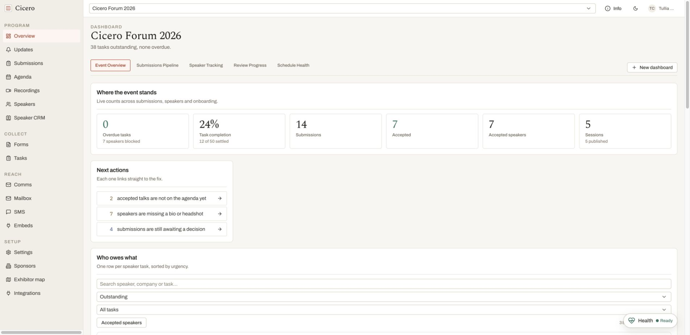
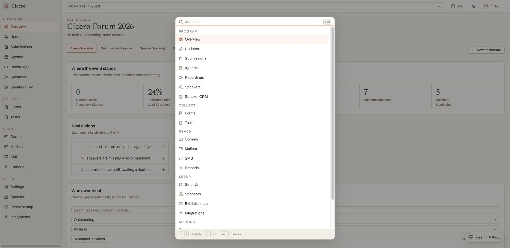
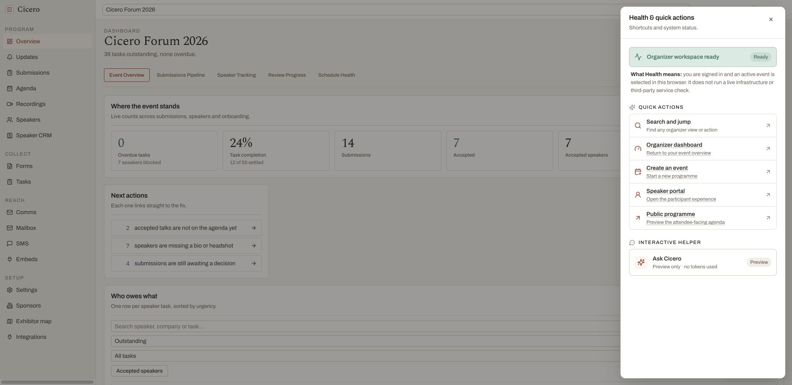
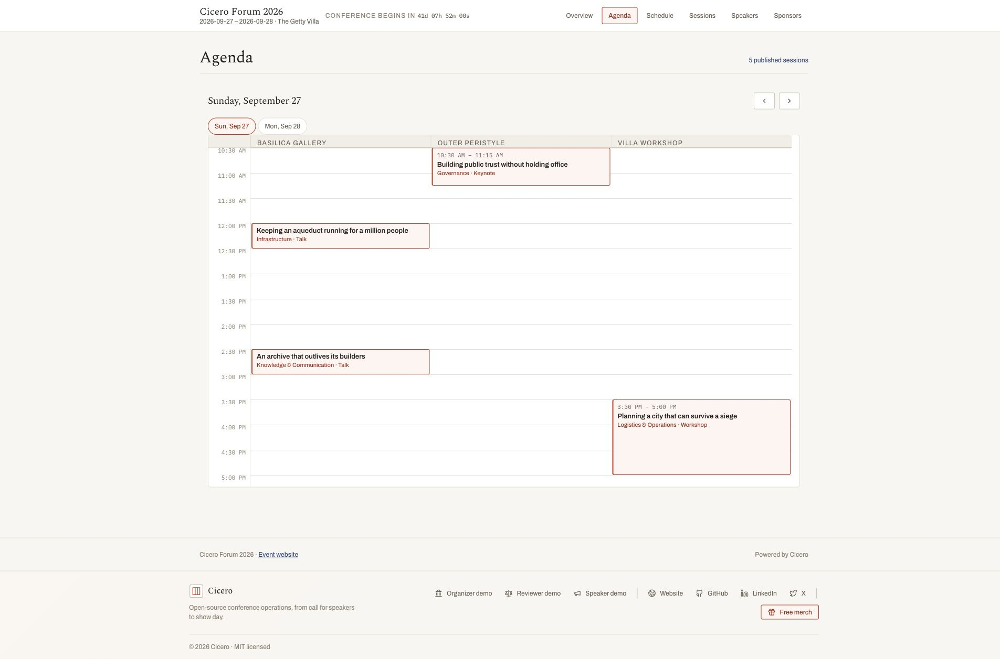

# Submission evidence

This is the dated verification record behind the claims in
[`06-submission-narrative.md`](06-submission-narrative.md). It preserves two layers of evidence: the
production-build/browser capture from 16 August and the source/documentation refresh from 17 August.
The hosted demo remains on an older revision, so current-source and deployed claims stay separate.

**Submission refresh verified:** 2026-08-17

**Product baseline audited:** `1017ca9` (`origin/main` at the final source audit)

**Production-build/browser capture:** 2026-08-16 at `ce8d88b`

**Hosted demo rechecked:** 2026-08-17

**Submission Worker refreshed and verified:** 2026-08-17 (initial refreshed publish
`393b28c7-8fed-4d55-bfee-68ab736f9773`)

**Hosted demo:** <https://cicero-three.vercel.app>

**Readable HTML:** <https://cicero-submission.elehche.workers.dev/submission/evidence.html>

**Repository mirror:** [`submission/evidence.html`](submission/evidence.html)

**Field survey:** <https://cicero-field-survey.elehche.workers.dev/>

## Current-source submission refresh

The refresh traced every merged product commit from the original narrative in `f68026a` through the
`1017ca9` baseline. It corrected stale roadmap language and added the shipped capabilities that had
not reached the submission: event duplication, speaker availability, revocable draft-programme
links, numbered restorable content revisions, typed scorecard criteria, advisory milestones,
attendee agenda starring and personal schedules, seven live embed views, JSON/XML/subscribable
`.ics` output, per-event `llms.txt`, the readable and Scalar API references, browser CORS, the
demo-first landing path, and the renamed Actions panel.

The final source audit also incorporates the post-refresh product work: idempotent small, medium,
and large versions of the same demo conference; one acting-user lookup per request; recording-board
mutations that refresh in place; consistent truncation and explicit score scales in dense organizer
tables; validated identifiers and caller input returning useful client errors; and unavailable
database connections returning retryable service-unavailable responses rather than opaque 500s. It
also removes the landing page's repeated About facts while retaining its source link and anchor.

It also recovered the copy-ready form-answer draft from the unmerged `22a03e4` branch, updated its
testing path and product/process claims, and added it to the repository documentation maps without
publishing the form-only answers as a fourth standalone HTML tab.

The focused verification suite covered the new claims that do not require a database: the exhaustive
event-clone plan and clone transaction, speaker availability parsing, attendee schedule storage,
portable embed feeds, live embed samples, role-based demo entry, API CORS, the Actions panel, review
detail, and standalone-submission rendering. Results on the refresh branch:

| Check | Result |
| --- | --- |
| Full Vitest suite | 1,983 tests passed across 186 files |
| Focused Vitest suite across 11 files | 147 tests passed |
| `bun run typecheck` | Passed |
| `bun run build` | Production build passed; route table includes event duplication, availability, share-link, feed, API-reference, embed-gallery, and per-event `llms.txt` surfaces |
| `bun run docs:submission` | Regenerated all three standalone reading copies from the refreshed Markdown |
| `git diff --check` | Passed |

The source tree also retains database-backed integration coverage for share-link privacy/revocation,
content revision restore, and schema migrations. This refresh did not start a new external `sbek`
evaluation cycle; the preserved evaluator runs remain in `docs/evals/sessionboard/`.

## Standalone submission mirror: current-branch verification

The three public artifact Markdown documents are mirrored into standalone, checked-in HTML files;
the copy-ready form answers remain source-only. The generated pages remain repository artifacts
rather than application routes, can be opened directly or served from any local static file server,
and are published separately at
<https://cicero-submission.elehche.workers.dev/>.

| HTML artifact | Canonical source | Browser result |
| --- | --- | --- |
| `docs/submission/index.html` | `docs/06-submission-narrative.md` | Full write-up, cross-document links, source links, headings, code and feature tables rendered |
| `docs/submission/summary.html` | `docs/06-submission-summary.md` | Short-form copy rendered and the Short form tab was identified as the active document |
| `docs/submission/evidence.html` | `docs/06-submission-evidence.md` | Evidence tables and all five relative screenshot assets loaded successfully |

`bun run docs:submission` regenerates all three files. CI runs the generator and fails if
`docs/submission/` changes, making drift between the prose sources and reading copies visible. The
17 August refresh regenerated the three copies and reran the renderer tests. The original headless
browser navigation, screenshots, and video remain attached to
[PR #185](https://github.com/EllAchE/sessionboard-oss/pull/185).

## Public artifact Workers: live verification

The repository artifacts were published independently from the application on 16 August 2026. The
submission Worker was refreshed from the current branch and reverified on 17 August:

| Public origin | Deployment shape | Live result |
| --- | --- | --- |
| <https://cicero-submission.elehche.workers.dev/> | Generated submission HTML, stylesheet and evidence images behind a dedicated static Worker; source-document links redirect to GitHub | Root redirected to the refreshed full write-up; full, short-form and evidence pages returned HTTP 200; stylesheet and sampled evidence image returned HTTP 200; the live evidence copy contained the audited baseline and full-suite result |
| <https://cicero-field-survey.elehche.workers.dev/> | One self-contained generated survey document behind a second dedicated static Worker | Root returned HTTP 200 with all 71 feature rows and no external asset dependency |

Both origins returned content security, anti-framing, referrer and MIME-sniffing protections. Browser
verification found no console warnings or errors. The submission stylesheet loaded, all five lazy
evidence images completed with non-zero natural widths, and the survey's search, reset,
“Only beyond-the-brief” mode and feature-detail interaction worked. The reciprocal survey-to-write-up
link was also navigated successfully. These are public static Workers, not routes in the Cicero
Next.js application; the production build route table remains unchanged.

The refreshed submission Worker was first published as version
`393b28c7-8fed-4d55-bfee-68ab736f9773`. Its root returned HTTP 302 to
`/submission/index.html`; the full write-up, short form, evidence page, stylesheet, and a sampled
evidence image all returned HTTP 200. The responses retained the content-security, anti-framing,
referrer, permissions, opener, and MIME-sniffing protections. After these facts were written into
this evidence record, the generated pages were published once more so the live copy includes its
own verification result.

During the 16 August artifact work, the production origin was rechecked after that PR branch was
pushed. `/demo/agenda`
remained healthy and its browser view reported 11 published sessions across five rooms. A
subsequent API read returned HTTP 200 with 12 sessions across five rooms and zero unscheduled
sessions; the hosted seed is mutable, so those counts are point-in-time evidence rather than a
fixture guarantee. The standalone submission artifacts remain outside the application deployment
and are served by their own static Worker.

## 2026-08-16 source: local production build and seeded walkthrough

The `ce8d88b` source was run as the production Docker image, backed by fresh Postgres and MinIO
containers. Host ports `3217`, `5545`, `9100`, and `9101` were used so unrelated local stacks were
left untouched.

```bash
docker compose \
  -f docker-compose.yml \
  -f /private/tmp/cicero-s134501-compose.override.yml \
  up -d --build
docker compose \
  -f docker-compose.yml \
  -f /private/tmp/cicero-s134501-compose.override.yml \
  exec app npm run db:seed
```

The image build completed successfully, the app ran its migrations before serving, and the seed
reported:

| Event | Submissions | Speakers | Scheduled sessions | Tasks |
| --- | ---: | ---: | ---: | ---: |
| `demo` / Cicero Forum 2026 | 14 | 7 | 5 | 7 |
| `first-settlement` / The First Settlement | 11 | 12 | 5 | 4 |

The following browser checks were then performed against `http://localhost:3217`:

| Surface | What was exercised | Result |
| --- | --- | --- |
| `/` | Public landing page | Rendered successfully |
| `/demo/agenda` | Signed-out published programme | Two dates, five published sessions, three rooms |
| Reserved demo sign-in | `organizer@example.com`, on-screen single-use magic link | Redeemed and redirected to `/organizer` |
| `/organizer` | Seeded organizer dashboard | Current event, counters, next actions, and 38 outstanding tasks rendered |
| Command menu | `⌘K` / `Ctrl-K` | Opened searchable organizer navigation and actions |
| Health & quick actions | Persistent bottom-corner control | Readiness explanation and one-click organizer, event, portal, and public-programme routes rendered |

The broader submission queue and review bindings described in the narrative were verified against
the current source and its component tests; only the global command menu was exercised in this
browser capture.

### Local evidence

#### Seeded organizer dashboard



#### Keyboard command menu



#### Workspace readiness and quick actions



#### Signed-out published agenda



## Hosted demo verification

The public deployment was rechecked on 17 August before the documentation update:

| Surface | Live result on 2026-08-17 |
| --- | --- |
| `/` | HTTP 200; still the pre-refresh landing revision |
| `/demo/agenda` | HTTP 200 |
| `/api/v1/events/demo/agenda` | HTTP 200; five published sessions across three rooms, zero unscheduled |
| Organizer route family | Still exposes the older `/admin` shell rather than current-source `/organizer` |

The following checks were performed against <https://cicero-three.vercel.app>:

| Surface | Result on 2026-08-16 |
| --- | --- |
| `/demo/agenda` | Rendered five published sessions in the three-room agenda |
| `/embed/demo/agenda` | Rendered the same signed-out agenda as an embed |
| `/api/v1/events/demo/agenda` | HTTP 200, JSON, two days, five sessions, three rooms, zero unscheduled |
| `/first-settlement` | Rendered the seeded public event: five sessions, twelve speakers, four tracks |
| `/submit/first-settlement/motions` | Public CFP route resolved from the event page |
| Reserved organizer demo access | On-page magic link redeemed successfully |
| Organizer dashboard | Authenticated dashboard rendered counters, next actions, task ownership, and seeded records |

### Hosted evidence

#### Hosted agenda


## Deployment parity finding

The hosted demo is healthy for the public and authenticated core paths above, but the 17 August
recheck confirms that it is running an older application revision than the current source tree:

- the hosted organizer shell uses legacy `/admin` routes; current source uses `/organizer`;
- the hosted landing content is the earlier Roman-themed version;
- current-source additions such as the expanded command-driven review workflow, Updates navigation,
  Exhibitor map navigation, the latest assisted-chasing surface, event duplication, attendee
  starring, live embed gallery, and current API-reference work should be demonstrated from source
  until a fresh deployment is made.

This is a deployment-parity gap, not a claim that the hosted demo is down. Submission language
should say that the hosted **core demo works**, and should not say that every screenshot from current
`main` is already deployed. A final pre-submission deploy and repeat of this checklist would close
the gap.

## What the persistent Actions workspace status means

The 16 August screenshot labels the floating control **Health**. Current source renames the broader
container **Actions**, puts a real keyboard binding on every row, and retains the same deliberately
narrow workspace status inside it: Ready means the organizer is signed in and an active event is
selected in that browser. It does not poll Postgres, object storage, email/SMS providers,
Accelevents, or the deployment platform. The UI and submission keep that boundary explicit so a
green status is never mistaken for infrastructure monitoring.
